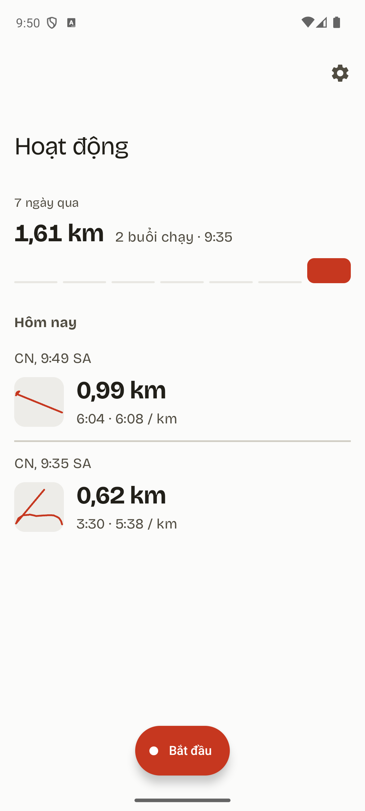
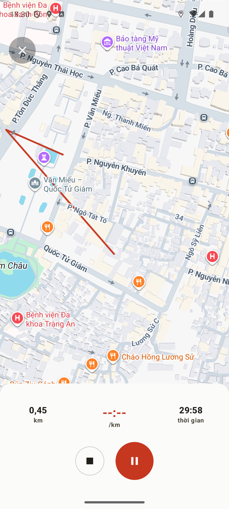
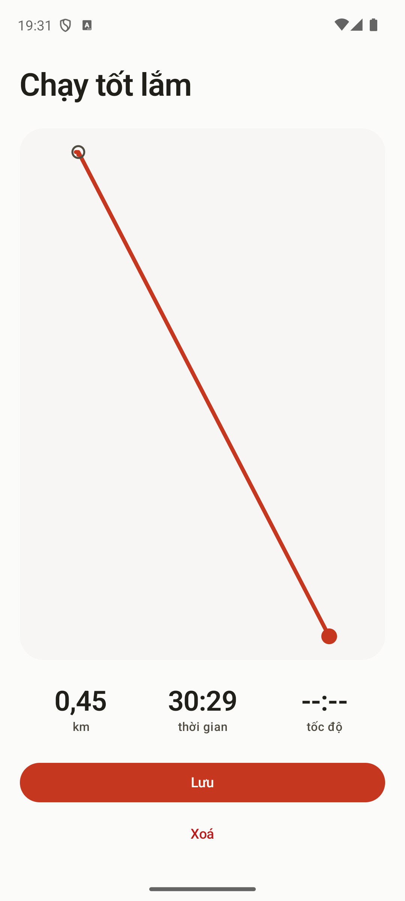
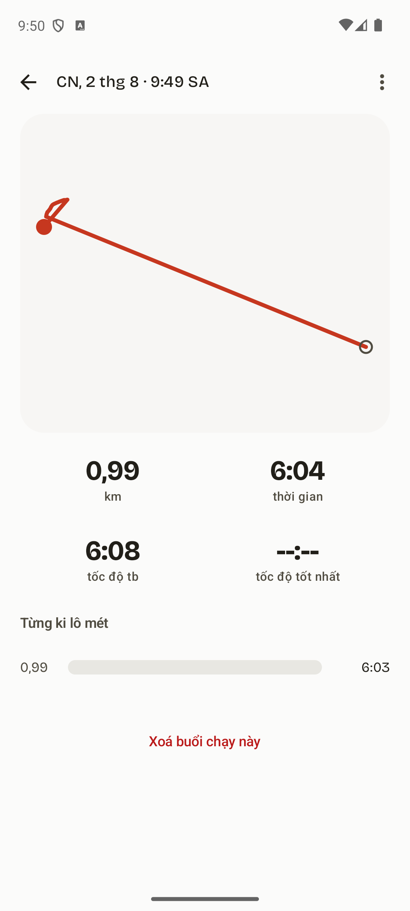
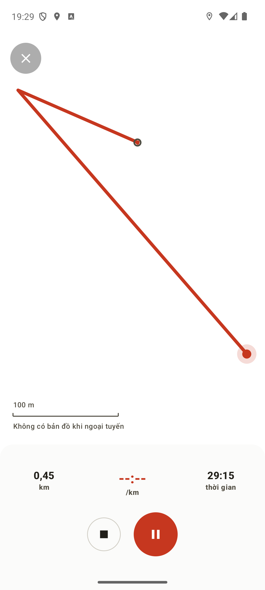
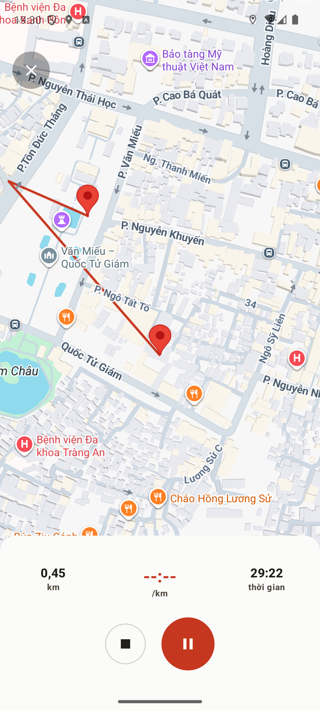
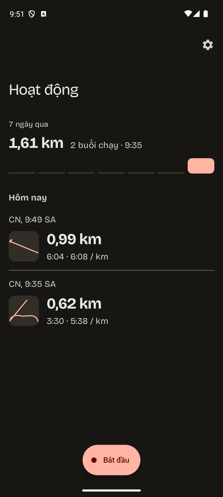
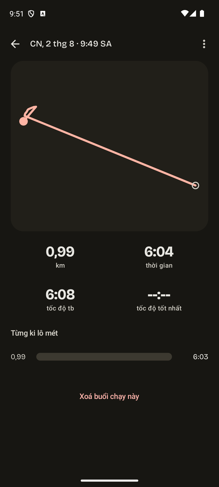
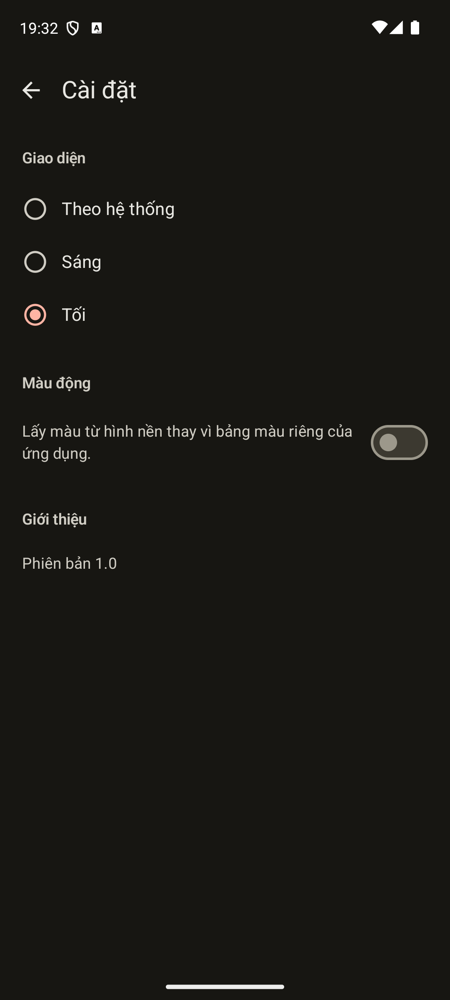
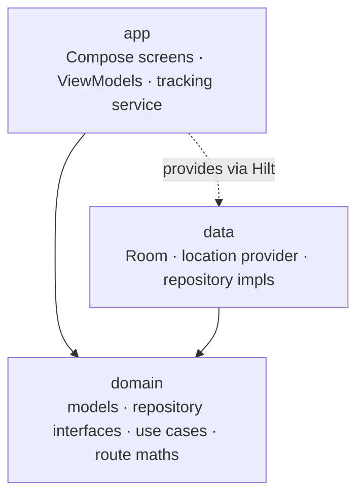

<p align="center">
  <picture>
    <source media="(prefers-color-scheme: dark)" srcset="docs/screenshots/app-icon-dark.png">
    
  </picture>
</p>

<h1 align="center">Chạy Ngay Đi</h1>

<p align="center">
  A running tracker for Android. Records your route with GPS, keeps everything on the phone, and
  works with no signal at all.
</p>

<p align="center">
  
  
  
  
  <a href="LICENSE"></a>
</p>

Tap record and go. The route draws as you run, the numbers stay readable at a glance, and when you
stop you get a summary of what you just did instead of being dropped back into a list. Past runs
keep their route, their splits per kilometre, and a name you can give them.

There is no account, no feed, and no server. Everything lives in a database on your phone, which is
also why it keeps working underground or out of coverage: the route is drawn from your own GPS
fixes, not from anything downloaded.

The visual direction is *Editorial Instrument*. Two modes in one system: the reflective screens are
editorial, with generous space and the numbers themselves as the graphic element, while the live
recording screen is an instrument, built to be glanced at by someone who is moving and cannot read.
The clay red route line is the thread between them, drawn live while you run, as the hero of a
finished run, and as the thumbnail on every row.

## Screenshots

Captured on a Pixel 6a emulator with the app in Vietnamese, its primary language. Distances read
`0,45 km` with a comma because the formatters follow the device locale rather than a pinned one.

<table>
  <tr>
    <th>Runs</th>
    <th>Recording</th>
    <th>Summary</th>
  </tr>
  <tr>
    <td></td>
    <td></td>
    <td></td>
  </tr>
</table>

Runs groups by day with relative headings, and the week strip above it answers why you would open
the app when you are not running. Stopping goes forward to the summary, not back to the list.

<table>
  <tr>
    <th>Run detail</th>
    <th>No signal</th>
    <th>Settings</th>
  </tr>
  <tr>
    <td></td>
    <td></td>
    <td></td>
  </tr>
</table>

The middle one is the app with no map available. The route, the scale bar and every metric are
still there, because none of them need the network. The map is the only thing missing, and it says
so rather than showing an empty screen.

Dark mode is a first-class theme rather than an inverted afterthought, and you can pin it in
Settings regardless of what the system is doing.

<table>
  <tr>
    <th>Runs, dark</th>
    <th>Run detail, dark</th>
    <th>Settings, dark</th>
  </tr>
  <tr>
    <td></td>
    <td></td>
    <td></td>
  </tr>
</table>

## Features

- **Recording that survives the phone.** A foreground service keeps the session alive when you
  background the app, lock the screen, or the process is killed and restarted. Duration comes from
  a monotonic clock, so a clock change or a timezone shift mid-run cannot corrupt it.
- **Distance you can trust.** GPS wobble while you stand still is excluded from the total, and a
  single impossible fix cannot add a kilometre to your run. Both rules are shared with the splits,
  so the per-kilometre numbers always add up to the distance at the top of the screen.
- **Works with no signal.** The route is drawn from your own fixes onto a canvas, projected to true
  ground distances so the shape matches what a map would show, with a scale bar because a view that
  refits itself as you run has no fixed zoom to infer. This is not a placeholder: the map renderer
  ships as a Play Services module fetched at runtime, so on a phone that has never downloaded it
  there would otherwise be nothing on screen at all.
- **A moment after the run.** Stopping goes to a summary with the route, the distance, the time and
  the pace. A run under 100 m offers to delete itself, which is what a tap-record-then-tap-stop
  mistake actually produces.
- **Runs you can look back at.** Each one opens to its full route, four metrics, and per-kilometre
  splits with a bar for relative pace. The fastest complete kilometre is marked; a partial closing
  split never counts as the best, because extrapolating 200 m to a full kilometre reports a pace you
  never ran.
- **Name, share, delete.** Give a run a name and it replaces the timestamp in the list, which is the
  only place a name is any use. Sharing hands a plain-text summary to the system sheet. Deleting is
  a swipe with five seconds of undo and no confirmation dialog.
- **Vietnamese and English.** Vietnamese is the primary language. Units, plurals and day names all
  come from resources rather than being assembled in code, and numbers follow the device locale, so
  a Vietnamese reader sees `0,45 km` and an English one sees `0.45 km`.
- **Themes, your choice.** System, Light or Dark, applied app-wide and remembered. Dynamic colour is
  offered but off by default: an app whose identity is its palette should not hand that to your
  wallpaper on first launch.
- **Accessibility that is checked, not claimed.** Every colour pair the app draws text with is
  measured against WCAG AA in both themes by a test, so a nudged colour fails the build. Every
  control is at least 48 dp, measured after layout rather than read from the file. All four screens
  are exercised at 150% font scale. If you have animations turned off system-wide, the app does not
  animate.
- **Landscape.** The recording sheet becomes a side rail so the map keeps most of the screen instead
  of being letterboxed.

## Tech stack

| Layer | Choice |
| --- | --- |
| Language | Kotlin 2.4, Coroutines and Flow throughout |
| UI | Jetpack Compose, Material 3, with the recording screen still on Views |
| Navigation | Navigation Component with Safe Args |
| DI | Hilt |
| Persistence | Room, schema exported and every migration tested |
| Preferences | DataStore |
| Location | Fused Location Provider in a foreground service |
| Maps | Google Maps SDK, with a Canvas fallback that needs no map at all |
| Testing | JUnit, Robolectric, Compose UI testing, MockK, Turbine, 426 unit tests plus instrumented tests |
| Build | AGP 9.3, minSdk 29, targetSdk 37, R8 on for release |

## Architecture

Clean Architecture across three Gradle modules, with dependencies pointing one way:
`app` -> `domain` <- `data`.

`domain` is a pure JVM module. It holds the models, the repository interfaces, the use cases and
the maths for distance, pace, splits and route encoding, and it imports nothing from Android,
Google or the layers above it. A test fails the build if that ever stops being true.



| Module | Contents |
| --- | --- |
| `domain/` | `LocationPoint`, `SessionSummary`, `Split`, repository interfaces, use cases, and `DistanceCalculator`, `SplitsCalculator`, `GpsFixValidator`, `RoutePolyline` |
| `data/` | Room database, DAOs and migrations, `FusedLocationTrackingRepository`, `SessionRepositoryImpl`, entity mappers |
| `app/` | `ui/runs`, `ui/record`, `ui/summary`, `ui/detail`, `ui/settings`, the shared `ui/route` drawing toolkit, `TrackingService`, and Hilt modules |

The location settings check lives in `data`, not `app`, so Play Services types never reach the UI
layer. A test enforces that too, because the same rule was written in a comment first and drifted.

## Getting started

You need JDK 17+, Android Studio, and a Google Maps API key. The app runs without the key, it just
shows the canvas route instead of a map.

1. **Clone the repo**
   ```bash
   git clone https://github.com/nphkhiem/SimpleTracking.git
   cd SimpleTracking
   ```
2. **Get a Maps key.** Create a project in the
   [Google Cloud console](https://console.cloud.google.com/google/maps-apis), enable **Maps SDK for
   Android**, and create an API key.
3. **Configure it locally.** Add this to `local.properties` at the repo root. That file is
   gitignored, so never commit a real key:
   ```properties
   MAPS_API_KEY=your_key_here
   ```
4. **Run it**: open the project in Android Studio and run the `app` configuration, or from the
   command line:
   ```bash
   ./gradlew :app:installDebug
   ```
5. **Run the checks**:
   ```bash
   # Unit tests for every module, plus compiling the instrumented suite
   ./gradlew check lint

   # Instrumented tests (needs a running emulator or device)
   ./gradlew :app:connectedDebugAndroidTest
   ```

> [!NOTE]
> `check` deliberately compiles the instrumented suite as well. It stopped compiling once during
> the migration to Compose and nothing went red, because `check` does not build it by default.

## Tests

426 unit tests across the three modules, plus instrumented tests covering the recording and
recovery flows against real Room persistence. Everything runs on every pull request through GitHub
Actions.

Some of them are worth knowing about, because they guard decisions rather than lines:

- `ContrastTest` measures every foreground and background pair against WCAG AA in both themes, so a
  palette change that breaks contrast fails the build instead of shipping.
- `ModulePurityTest` and `ModuleBoundaryTest` fail if `domain` imports anything from Android, or if
  the UI layer starts handling Play Services location types.
- `DesignTokenUsageTest` fails on a hardcoded colour in any layout or drawable, and on any inline
  text size.
- `AppDatabaseMigrationTest` runs each migration against a database built at the previous version,
  because a missing migration is a crash loop for everyone who already installed the app.
- `SplitsCalculatorTest` asserts the splits add up to exactly the distance shown at the top of the
  screen. Splits that disagree with the headline number are worse than no splits.

## Contributing

1. Fork and branch off `main`
2. Follow the existing layering and naming
3. Run `./gradlew check lint`; it should be green with no new warnings
4. Open a pull request describing what changed and why

Bug reports and ideas are welcome as GitHub issues.

## License

MIT, see [LICENSE](LICENSE). Fork it, extend it, ship your own version.

---

Built test-first. Most of the interesting bugs were still found by running it.
